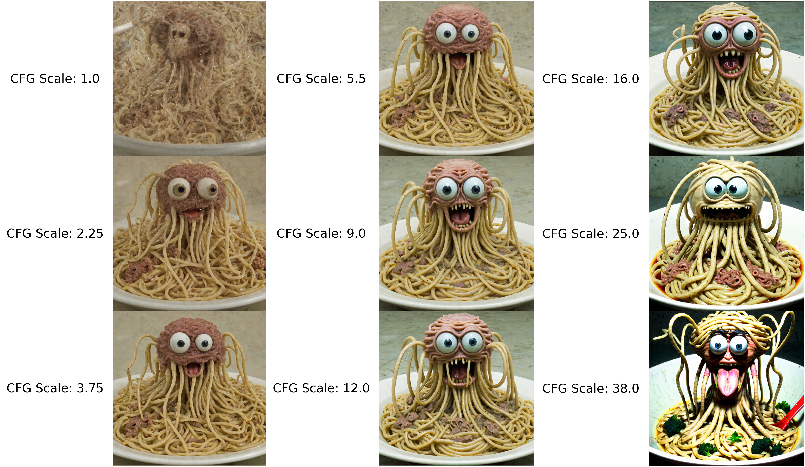

# 🧠 Understanding Stable Diffusion in EmProps Studio

### Introduction 

Stable diffusion is the process that powers EmProps Studio's AI-driven image generation. This technology transforms textual prompts into complex images using a deep learning model. To master image creation, it's essential to understand the following key terms and their impact on the final output.

### CFG Scale (Classifier Free Guidance Scale) 

* Definition: CFG Scale influences how closely the AI-generated image adheres to the text prompt. A higher CFG Scale makes the AI pay more attention to the prompt, which can result in images that more accurately reflect the described concept.
*   Impact: Choosing the right CFG Scale can be a balancing act. Too high may produce repetitive or overly literal images, while too low may yield images that diverge significantly from the prompt.

    A CFG of 7 is generally a healthy middle, where as you go lower it becomes more desaturated, wispy and ethereal. With much higher CFG's, the image starts to get oversaturated and deep-fried.

<figure><figcaption>
"The flying spaghetti monster emerging from its noodley realm"  Sampling Steps: 30, Sampling Method: DPM++ 2M Karras, Checkpoint: JuggernautXL, Resolution: 1024x1024
</figcaption></figure>

### Sampling Steps 

* Definition: Sampling Steps denote the number of iterations the model performs to refine the generated image. Each step allows the AI to adjust the image's details and complexity.
* Impact: More steps typically lead to higher-quality images, but also require more computational power and time. Fewer steps result in quicker outputs but may reduce image fidelity or detail. Sampling steps affect how many credits are required for the image generation, so keep that in mind.&#x20;
  * 20-40 steps is usually a good range.

<figure><figcaption>
"a painter wearing a cute felted yellow mask embroidered with a large smiley-face and wearing colorful overalls, in the style of surreal human figures, detailed textures, contemporary outsider art, playfully intricate, indoor art-gallery exhibit, cozy lo-fi vaporwave-inspired 90s aesthetics" CFG: 7, Checkpoint: SDXL, Resolution: 960 x 1280
</figcaption></figure>

### Sampling Method 

* Definition: Samplers are algorithms that guide the decision-making process during image generation. Different samplers can affect the style and texture of the output.
* Impact: The choice of sampler can affect the visual coherence and the aesthetic quality of the images. It's often a matter of experimentation to find the sampler that best aligns with the desired artistic outcome.

<figure><figcaption>
"long white fence leading to red barn on top of green hill, blue sky, in the style of David Hockney and in the style of Richard Avedon" Sampling Steps: 30, CFG: 7, Checkpoint: SDXL, Resolution: 1024x1024
</figcaption></figure>

&#x20;_Note: While sampling methods tend to have a subtle effect on the aesthetic, the biggest differences are between standard and ancestral methods.. An 'ancestral' sampling method, marked by an 'a' (e.g., 'Euler a'), evolves with additional steps, unlike those that adhere to a specific aesthetic without extra steps. Generally, 20-30 steps offer a balanced approach._

### Denoising Strength 

* Definition: Denoising in the context of stable diffusion refers to how much detail is retained or removed from the starting image in image-to-image (img2img) tasks.
* Impact: The denoising setting can greatly influence the final image. Higher denoising levels make the AI fill in more details, potentially altering the original image more drastically. Lower levels of denoising maintain more of the source image's structure and details.

<figure><figcaption>
[EmProps Logo to "needlefelted mantis shrimp"] Sampling Steps: 40, CFG: 7, Sampling Method: DPM++ 2M Karras, Checkpoint: SDXL, Resolution: 1024x1024
</figcaption></figure>

### Prompt Engineering 

Prompt Engineering is the skillful crafting of input text to guide the AI towards the desired outcome:

* Keywords and Modifiers: Adding descriptive keywords and modifiers can lead to significant changes in the generated images.
* Balancing Specificity and Variety: Striking the right balance between detailed instructions and leaving room for AI interpretation is crucial for effective prompt engineering.
*   Negative Prompt: A negative prompt describes what the model will avoid generating. This is one of the most handy tools in an AI artist's arsenal.

    #### Using Custom Prompt Commands for Image Generation 

    The prompt commands in EmProps Studio allow for granular control over the weight and interpretation of words in a prompt. Here’s how to use them effectively:

    1. `(word)`: Slightly increase attention to "word" by a factor of 1.1.
    2. `((word))`: Increase attention more significantly, by a factor of 1.21 (1.1 squared).
    3. `[word]`: Decrease attention to "word" by a factor of 1.1.
    4. `(word:1.5)`: Increase attention to "word" by a factor of 1.5.
    5. `(word:0.25)`: Decrease attention to "word" by a factor of 4 (1 divided by 0.25).
    6. `\(word)\`: Use literal parentheses in the prompt.
    7. `[word | word]`: Blend two prompts, with weights applied if specified.
    8. `(word | word)`: Another method to blend prompts, with weights if needed.
    9. `[word:word:step#]`: Start with "word" and after "step" iterations, transition to the second "word". The transition rate is dependent on the Sampling Steps.
    10. \[word AND word] : the "AND" command ensures both parts of the prompt are given strong focus and attention.&#x20;

    Use these commands to guide the AI toward desired outcomes or to experiment with new creative possibilities. Adjusting these parameters can significantly alter the generated images, providing a powerful tool for artists and creators.

### Conclusion 

So, there you have it—a peek under the hood of the stable diffusion engine driving EmProps Studio. While it might sound like you need a degree in artificial intelligence to get started, the truth is far simpler. Just like picking up a new instrument or diving into a video game, it's all about playing around and seeing what happens.

Start with some basic prompts and tweak one setting at a time. If you'd like to see exactly how the changes affect your images, you can keep the same seed and settings by selecting _Set hashes manually_ under Setup. There's a whole spectrum of possibilities between a whisper of an idea and the crystal-clear rendering of your thoughts. And the best part? Each attempt teaches the system—and you—a little more about what works. It's a creative partnership with AI where the learning curve is half the fun.

So don't be daunted by the jargon. Jump in, start creating, and let the surprises unfold. After all, the most intriguing creations often come from the unexpected!
