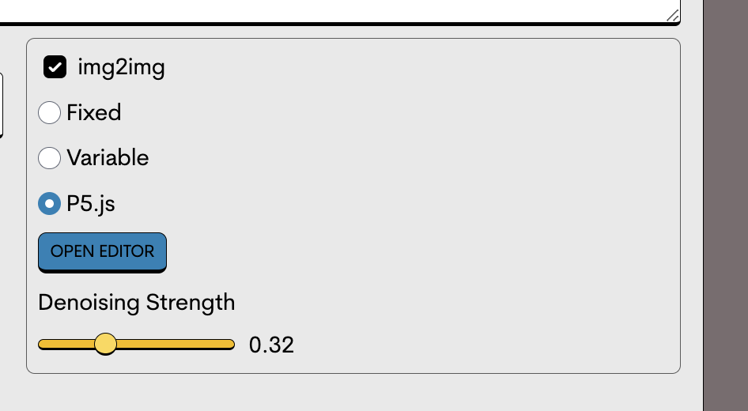

# 🏥 Getting Help

When you encounter issues or have questions while using EmProps Studio, accessing support is straightforward and user-centric. EmProps offers two primary ways to get the help you need: through our integrated **Intercom** node and our dedicated **Discord** server. Here’s how to use these resources effectively.

### Option 1: Using the Intercom Node 

If you couldn't find the information you were looking for in our documentation, don't hesitate to reach out to our team via our main support network, Intercom. You can reach out to our team directly from within the EmProps Studio via the Intercom icon in the bottom-right of your screen. It looks like \*this\*

<figure><figcaption>
Intercom Support Button, as seen in the OpenStudio
</figcaption></figure>

### Steps to Use Intercom: 

1. Access Intercom: Navigate to any page within EmProps Studio. You’ll find the Intercom icon in the bottom-right corner of the screen.
2. Initiate Chat: Click on the icon to open a chat window. This service connects you directly to a live support agent.
3. Describe Your Issue: Clearly state your problem or question in the chat. Providing details such as screenshots, steps you’ve already tried, and what you are trying to achieve will help the support team assist you more effectively.
4. Follow Up: Once your initial query is sent, our team will respond promptly. Keep the chat window open for live interaction, or you can come back to it when you receive a notification of a response.

Using the Intercom node ensures that you get quick responses and can have a real-time conversation about your issue, making it the most efficient way to resolve immediate concerns.

### Option 2: Discord Support Channel 

If you prefer to use Discord or require more detailed assistance that may involve community feedback, our Discord server is the right choice. Here’s how to reach out:

### Steps to Use Discord for Support: 

1. Join the Server: If you haven’t already, join the EmProps Discord server using the invite link: [EmProps Discord Server](https://discord.gg/yYKUP9349Y).
2. Navigate to Support Channel: Once on the server, go to the "#🚨ᅵticket-tool-support-feedback" channel. This channel is specifically designed for user support.
3. Create a Ticket: Use the ticket tool in the channel to create a new support ticket. Fill out the requested information, detailing your issue as much as possible.
4. Wait for Response: After submitting your ticket, a team member will review your issue and respond as soon as possible. Monitor the ticket for updates and further instructions.

### Option 3: Email:

If Discord or Intercom are not your cup of tea, you can always reach out to our support team via support@emprops.ai. The turnaround time on emails is a bit slower than the other methods.

### Regarding Feedback:

We're constantly looking to improve our documentation. If you have suggestions or find any errors, please let us know on Intercom or Discord. Your input helps us make EmProps better for everyone!

### Conclusion 

Whether you choose the direct and quick assistance of the Intercom node within Studio or the community-engaged approach of our Discord channel, EmProps is committed to providing the support you need to ensure a smooth and enjoyable experience. Don’t hesitate to reach out with any issues or feedback—we’re here to help!
