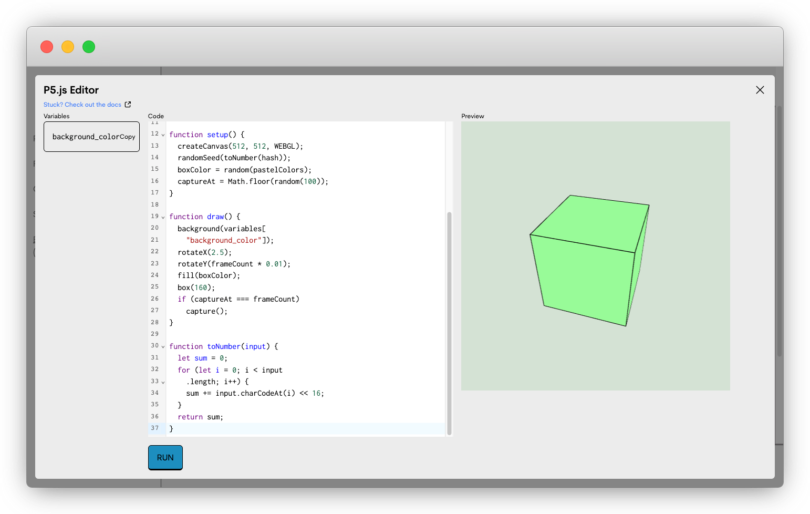
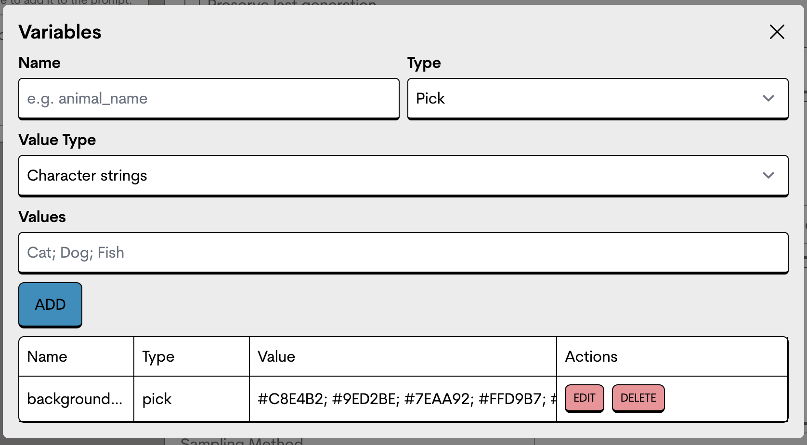

# P5.JS

## P5.js

OpenStudio’s p5.js allows you to provide a dynamic input as a source image for **img2img** work.

### Getting Started

After checking the **img2img** option you have the option to choose **P5.js.**

<figure><figcaption><p>select the P5.js option under img2img to get started</p></figcaption></figure>


Once selected you can open the editor and write P5.js. The output will act as the image for **img2img** generation.

<figure><figcaption><p>Character String Variables can be imported into the p5.js node</p></figcaption></figure>

### How it works

Behind the scenes, our generators run the p5 code in a virtual browser. The browser captures the output in its window and passes it to Stable Diffusion.

## Features

### Variables Support

You can use variables defined in the `Variables` section of your project. Only `Character string` value types are supported. In order to use them, a global `variables` object is exposed to your P5.js script:

<figure><figcaption><p>Character String Variables can be created within the Variables node</p></figcaption></figure>

```jsx
function draw() {
  background(variables["background_color"]);
  // or use dot notation
  background(variables.background_color);
}
```

The preferred syntax for using variables is `variables["myVariable"]`

### Pseudorandom number generator

EmRandom is a set of utility functions that helps artists to generate pseudorandom numbers.

### the “hash” variable

```
pseudorandomSeed(hash)
const randomFloat = pseudorandom(1,100)
console.log(randomFloat)
```

### EmRandom Methods

#### **pseudorandomSeed(seed) ⇒ void**

This function initializes the pseudo-random number generator with the provided string seed.

#### **pseudorandom(min = 0, max = 1) ⇒ number**

Generates a pseudo-random decimal number between the specified minimum (inclusive) and maximum (exclusive) values.

#### **pseudorandoms(n, min, max) ⇒ number**

Generates an array of pseudo-random integers within the specified range.

#### p**seudorandomInteger(min, max) ⇒ number**

Generates a pseudo-random integer within the specified range.

#### **pseudorandomIntegers(n, min, max) ⇒ number**

Generates an array of pseudo-random integers within the specified range.

#### **pseudorandomBoolean() ⇒ boolean**

Generates a pseudo-random boolean value (true or false).

#### **pseudorandomPick(array) ⇒ any**

Picks a random element from the given array.

#### **pseudorandomWeightedPick(array, weights) ⇒ any**

Picks a random element from the given array based on the provided weights.

#### **pseudorandomPickButNot(array, exclude) ⇒ any**

Picks a random element from the given array, excluding a specified element.

### Frame Capturing

Frame capturing enables artists to capture a particular frame of an animated script written in P5.js.

#### capture() ⇒ void

Captures the current frame, e.g.
